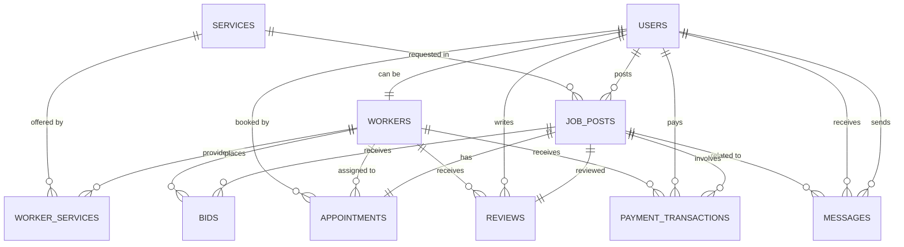

# Online Repair System – Database Relationships, Schemas, and Automation

## 📖 Introduction

**Project Title:** Online Repair System  
**Description:**  
This DBMS-based web project connects customers with local repair professionals (electricians, plumbers, appliance repair technicians, etc.) and functions similarly to platforms like UrbanClap or Justdial, but tailored for local use. The backend is powered by a relational database, and the system features a user-friendly frontend.

### 🔍 Problem Statement

People often struggle to find reliable and verified repair professionals nearby. There’s a lack of centralized systems where users can:
- Post repair service requests,
- Compare available workers,
- Chat, schedule, or review them in one place.

### 🎯 Objective

Build a database-driven web application where:
- Users can register and post repair jobs.
- Workers can bid for jobs based on their skills and availability.
- The system manages job assignments, real-time messaging, reviews, and optionally payments.

### 📚 DBMS Focus

The core of this project lies in its relational database design, including:
- Normalized tables (Users, Jobs, Bids, Appointments, etc.)
- Realistic one-to-one, one-to-many, and many-to-many relationships
- Triggers, stored procedures, and views for automation and performance
- Use of SQL queries, joins, and constraints to ensure data consistency

### 🔧 Tools & Tech Stack

- **Frontend:** HTML, CSS, JavaScript (React or plain JS)
- **Backend:** Node.js with Express (or Django)
- **Database:** MySQL or PostgreSQL
- **Optional:** Socket.IO for chat, Razorpay for payments

### 📈 Expected Features

- User and Worker registration/login
- Worker profile creation with skill tags
- Job posting and bidding system
- Scheduling & appointment management
- Chat between user and worker
- Ratings and reviews
- Admin panel for management

### ✅ Deliverables

- ER diagram and schema design
- SQL scripts (DDL + DML)
- A working full-stack web application
- Documentation and demo video (optional)

---

## ✅ List of Possible Queries (with Tables Used)

### 1. User Registration & Authentication
- Check if a user already exists by email — `Users`
- Register a new user — `Users`
- Validate login credentials — `Users`

### 2. Worker Profile Setup
- Create a worker profile — `Workers`
- Assign services/skills to a worker — `Worker_Services`
- Retrieve a worker’s full profile and skillset — `Workers`, `Worker_Services`, `Services`

### 3. Job Posting & Listing
- Post a new repair job — `Job_Posts`
- List all active/open jobs — `Job_Posts`
- List all jobs created by a specific customer — `Job_Posts`, `Users`

### 4. Search & Filter Workers
- Find available workers by service type and location — `Workers`, `Worker_Services`, `Services`, `Users`

### 5. Bidding and Assigning Jobs
- Place a bid for a job — `Bids`
- View all bids submitted for a job — `Bids`
- Accept a bid and mark the job as assigned — `Bids`, `Job_Posts`, `Appointments`

### 6. Appointments Management
- Schedule a service appointment — `Appointments`
- View all scheduled appointments for a worker — `Appointments`, `Workers`

### 7. Chat Messaging
- Send a message related to a job — `Messages`
- Retrieve full conversation thread for a job — `Messages`

### 8. Reviews and Ratings
- Submit a rating and review after job completion — `Reviews`
- Fetch the average rating of a worker — `Reviews`, `Workers`

### 9. Payments
- Record payment transactions — `Payment_Transactions`
- Calculate total earnings of a worker — `Payment_Transactions`

### 10. Admin Operations
- View all users and workers — `Users`, `Workers`
- Delete or moderate a review — `Reviews`
- Suspend or deactivate a worker account — `Users`, `Workers`

### 11. Views & Dashboard Queries
- View active job listings — `Job_Posts`
- View top-rated workers — `Workers`, `Reviews`

---

## 🔁 Possible Stored Procedures

Stored procedures are helpful for **repeating logic**, **automation**, or **business rules**. Examples:

| Procedure Name                               | Purpose                                                     |
| -------------------------------------------- | ----------------------------------------------------------- |
| `AssignWorkerToJob(jobId, workerId)`         | Automatically assigns a worker to a job, changes job status |
| `ScheduleAppointment(jobId, datetime)`       | Adds appointment and updates job state                      |
| `FinalizeJob(jobId)`                         | Marks job as completed, releases payment, enables review    |
| `CalculateWorkerEarnings(workerId)`          | Returns total payments received by a worker                 |
| `UpdateWorkerAvailability(workerId, status)` | Marks a worker as available/unavailable                     |
| `CreateJobWithDefaultStatus(...)`            | Creates a job with default values (e.g., "open" status)     |

---

## ⚡ Possible Triggers

Triggers help in **automated updates** when certain changes occur:

| Trigger Event            | Description                                                   |
| ------------------------ | ------------------------------------------------------------- |
| After inserting a review | Recalculate the worker’s average rating automatically         |
| After inserting a bid    | Change job status to "bidding" if it was "open"               |
| After accepting a bid    | Auto-assign job and reject other pending bids                 |
| After job completion     | Enable review/rating entry and mark worker as available again |
| After user registration  | Auto-generate default settings or notifications               |
| On deleting a worker     | Remove all their bids and appointments automatically          |

---

## Entity Relationship Summary

| Table 1                | Relationship Type         | Table 2              | Foreign Key(s) / Join Columns                        | Description                                                                              |
|------------------------|--------------------------|----------------------|------------------------------------------------------|------------------------------------------------------------------------------------------|
| **Users**              | One-to-One               | Workers              | Users.user_id = Workers.worker_id                    | A user can be a worker, but not all users are.                                           |
| **Workers**            | One-to-Many              | Worker_Services      | Workers.worker_id                                    | A worker can provide multiple services.                                                  |
| **Services**           | One-to-Many              | Worker_Services      | Services.service_id                                  | A service can be offered by many workers.                                                |
| **Users (Customer)**   | One-to-Many              | Job_Posts            | Users.user_id = Job_Posts.customer_id                | A customer can post many job requests.                                                   |
| **Services**           | One-to-Many              | Job_Posts            | Services.service_id                                  | A service type can be requested in many job posts.                                       |
| **Job_Posts**          | One-to-Many              | Bids                 | Job_Posts.job_id                                     | A job post can receive multiple bids.                                                    |
| **Workers**            | One-to-Many              | Bids                 | Workers.worker_id                                    | A worker can make multiple bids on jobs.                                                 |
| **Job_Posts**          | One-to-One (Unique FK)   | Appointments         | Job_Posts.job_id                                     | One appointment is typically scheduled per assigned job.                                 |
| **Workers**            | One-to-Many              | Appointments         | Workers.worker_id                                    | A worker can have many scheduled appointments.                                           |
| **Users (Customer)**   | One-to-Many              | Appointments         | Users.user_id = Appointments.customer_id             | A customer can have many scheduled appointments.                                         |
| **Job_Posts**          | One-to-One (Unique FK)   | Reviews              | Job_Posts.job_id                                     | A completed job gets one review.                                                         |
| **Users (Reviewer)**   | One-to-Many              | Reviews              | Users.user_id = Reviews.reviewer_id                  | A user can write multiple reviews.                                                       |
| **Workers (Reviewed)** | One-to-Many              | Reviews              | Workers.worker_id = Reviews.reviewed_worker_id       | A worker can receive multiple reviews.                                                   |
| **Users (Sender)**     | Many-to-Many             | Users (Receiver)     | Messages.sender_id, Messages.receiver_id             | Users can send/receive messages to/from other users.                                     |
| **Job_Posts**          | One-to-Many              | Messages             | Job_Posts.job_id (Nullable)                          | Messages can be related to a specific job post.                                          |
| **Job_Posts**          | One-to-Many              | Payment_Transactions | Job_Posts.job_id                                     | A job might involve multiple payment transactions (e.g., partial payments, refunds).      |

---

## Key Entities (Tables) and Their Schemas

### 1. Users Table
Stores information about all registered users, who can be either customers or workers.
| Column           | Type            | Attributes & Description                                             |
|------------------|-----------------|---------------------------------------------------------------------|
| user_id          | INT             | Primary Key                                                         |
| username         | VARCHAR         | UNIQUE                                                              |
| email            | VARCHAR         | UNIQUE                                                              |
| password_hash    | VARCHAR         |                                                                     |
| phone_number     | VARCHAR         | UNIQUE, NULLABLE                                                    |
| address          | TEXT            | NULLABLE                                                            |
| city             | VARCHAR         | NULLABLE                                                            |
| state            | VARCHAR         | NULLABLE                                                            |
| zip_code         | VARCHAR         | NULLABLE                                                            |
| registration_date| DATETIME        |                                                                     |
| is_worker        | BOOLEAN         | Default FALSE; Indicates if this user is also a worker              |
| last_login       | DATETIME        |                                                                     |

---

### 2. Workers Table
Stores additional details for users who are also workers (one-to-one with Users).
| Column             | Type                                              | Attributes & Description                         |
|--------------------|---------------------------------------------------|--------------------------------------------------|
| worker_id          | INT                                               | Primary Key, Foreign Key to Users.user_id         |
| bio                | TEXT                                              | NULLABLE                                          |
| average_rating     | DECIMAL                                           | NULLABLE (e.g., 4.5)                              |
| total_reviews      | INT                                               | Default 0                                         |
| hourly_rate_min    | DECIMAL                                           | NULLABLE                                          |
| hourly_rate_max    | DECIMAL                                           | NULLABLE                                          |
| availability_status| ENUM('available','busy','offline')                | Default 'available'                               |
| profile_picture_url| VARCHAR                                           | NULLABLE                                          |
| is_verified        | BOOLEAN                                           | Default FALSE                                     |

---

### 3. Services Table
Defines categories of repair and service types.
| Column         | Type      | Attributes & Description          |
|----------------|-----------|-----------------------------------|
| service_id     | INT       | Primary Key                       |
| service_name   | VARCHAR   | E.g., 'Plumbing', 'Electrical'    |
| description    | TEXT      | NULLABLE                          |

---

### 4. Worker_Services Table
Manages the many-to-many relationship between Workers and Services.
| Column            | Type      | Attributes & Description                        |
|-------------------|-----------|-------------------------------------------------|
| worker_service_id | INT       | Primary Key                                     |
| worker_id         | INT       | Foreign Key to Workers.worker_id                |
| service_id        | INT       | Foreign Key to Services.service_id              |
| expertise_level   | ENUM('beginner','intermediate','expert') | NULLABLE      |

---

### 5. Job_Posts Table
Stores details of job requests posted by customers.
| Column           | Type      | Attributes & Description                                |
|------------------|-----------|---------------------------------------------------------|
| job_id           | INT       | Primary Key                                             |
| customer_id      | INT       | Foreign Key to Users.user_id                            |
| service_id       | INT       | Foreign Key to Services.service_id                      |
| title            | VARCHAR   |                                                         |
| description      | TEXT      |                                                         |
| location_address | TEXT      |                                                         |
| latitude         | DECIMAL   | NULLABLE                                                |
| longitude        | DECIMAL   | NULLABLE                                                |
| budget_min       | DECIMAL   | NULLABLE                                                |
| budget_max       | DECIMAL   | NULLABLE                                                |
| preferred_date   | DATE      | NULLABLE                                                |
| preferred_time   | TIME      | NULLABLE                                                |
| posted_date      | DATETIME  |                                                         |
| status           | ENUM('open','bidding','assigned','in_progress','completed','cancelled') | Default 'open' |

---

### 6. Bids Table
Records bids made by workers on open job posts.
| Column       | Type       | Attributes & Description                        |
|--------------|------------|-------------------------------------------------|
| bid_id       | INT        | Primary Key                                     |
| job_id       | INT        | Foreign Key to Job_Posts.job_id                 |
| worker_id    | INT        | Foreign Key to Workers.worker_id                |
| bid_amount   | DECIMAL    |                                                 |
| message      | TEXT       | NULLABLE                                        |
| bid_date     | DATETIME   |                                                 |
| status       | ENUM('pending','accepted','rejected','withdrawn') | Default 'pending' |

---

### 7. Appointments Table
Schedules confirmed jobs between customers and workers.
| Column            | Type      | Attributes & Description                                |
|-------------------|-----------|---------------------------------------------------------|
| appointment_id    | INT       | Primary Key                                             |
| job_id            | INT       | Foreign Key to Job_Posts.job_id, UNIQUE (one per job)   |
| worker_id         | INT       | Foreign Key to Workers.worker_id                        |
| customer_id       | INT       | Foreign Key to Users.user_id                            |
| scheduled_datetime| DATETIME  |                                                         |
| actual_start_time | DATETIME  | NULLABLE                                                |
| actual_end_time   | DATETIME  | NULLABLE                                                |
| status            | ENUM('scheduled','in_progress','completed','cancelled') | Default 'scheduled' |

---

### 8. Reviews Table
Stores feedback and ratings provided by customers for completed jobs.
| Column             | Type    | Attributes & Description                        |
|--------------------|---------|-------------------------------------------------|
| review_id          | INT     | Primary Key                                     |
| job_id             | INT     | Foreign Key to Job_Posts.job_id, UNIQUE (one per job) |
| reviewer_id        | INT     | Foreign Key to Users.user_id (typically customer)|
| reviewed_worker_id | INT     | Foreign Key to Workers.worker_id                |
| rating             | INT     | 1-5                                             |
| comment            | TEXT    | NULLABLE                                        |
| review_date        | DATETIME|                                                 |

---

### 9. Messages Table
Facilitates real-time chat between users, optionally tied to a job.
| Column         | Type      | Attributes & Description                          |
|----------------|-----------|---------------------------------------------------|
| message_id     | INT       | Primary Key                                       |
| sender_id      | INT       | Foreign Key to Users.user_id                      |
| receiver_id    | INT       | Foreign Key to Users.user_id                      |
| job_id         | INT       | Foreign Key to Job_Posts.job_id, NULLABLE         |
| message_text   | TEXT      |                                                   |
| timestamp      | DATETIME  |                                                   |
| read_status    | BOOLEAN   | Default FALSE                                     |

---

### 10. Payment_Transactions Table
Tracks all payment-related activities.
| Column              | Type      | Attributes & Description                          |
|---------------------|-----------|---------------------------------------------------|
| transaction_id      | INT       | Primary Key                                       |
| job_id              | INT       | Foreign Key to Job_Posts.job_id                   |
| customer_id         | INT       | Foreign Key to Users.user_id                      |
| worker_id           | INT       | Foreign Key to Workers.worker_id                  |
| amount              | DECIMAL   |                                                   |
| currency            | VARCHAR   | E.g., 'INR', 'USD'                                |
| transaction_date    | DATETIME  |                                                   |
| payment_method      | VARCHAR   | E.g., 'credit_card', 'UPI'                        |
| status              | ENUM('pending','completed','failed','refunded') | Default 'pending' |
| payment_gateway_ref | VARCHAR   | Reference ID from payment gateway                 |

---

## Diagram Example

---

## 🌐 Technologies Stack (Common Choices)

### Frontend (User Interface)
- **HTML, CSS, JavaScript:** The fundamentals for any web page.
- **Frameworks/Libraries:**
    - **React, Angular, Vue.js:** Highly recommended for building dynamic, single-page applications (SPAs) with a rich user experience. They help manage complex UIs and improve performance.

### Backend (Server-Side Logic)
- **Node.js with Express.js:** (JavaScript-based) Popular for its speed, scalability, and ability to use JavaScript across the full stack.
- **Python with Django/Flask:** (Python-based) Django is a high-level framework that includes many features out-of-the-box, while Flask is more lightweight and flexible.
- **PHP with Laravel/Symfony:** (PHP-based) Still very widely used, mature, and has a large community.
- **Ruby on Rails:** (Ruby-based) Known for its convention-over-configuration approach, allowing for rapid development.

### Database
- **SQL Databases (Relational):**
    - **PostgreSQL:** Robust, open-source, and highly feature-rich. Excellent for complex relationships.
    - **MySQL:** Another very popular open-source choice, widely supported.
    - **SQLite:** Good for small projects or local development, but not recommended for production-scale web applications.
- **NoSQL Databases (Non-relational):**
    - **MongoDB:** (Document-oriented) Flexible schema, good for handling large amounts of unstructured data. Might be useful if your data structure is very dynamic.

### Authentication/Authorization
- **JWT (JSON Web Tokens):** For secure user authentication.
- **OAuth (if integrating with social logins like Google, Facebook):**

### Cloud Hosting (Deployment)
- **AWS (Amazon Web Services):** EC2, S3, RDS (for databases), Lambda.
- **Google Cloud Platform (GCP):** Compute Engine, Cloud Storage, Cloud SQL.
- **Microsoft Azure:** Virtual Machines, Blob Storage, Azure SQL Database.
- **Heroku, Netlify (for frontend), Vercel (for Next.js projects):** Simpler deployment options for smaller projects or specific needs.

---

## 🚦 Full Workflow for Project Development

### Phase 1: Planning and Design

1. **Define Core Features:**
    - User Registration (as Customer and/or Worker).
    - Worker Profile Creation (skills, experience, availability, location, rates).
    - Service Request Posting (customer describes issue, attaches photos, sets location).
    - Worker Search/Filtering (by service type, location, ratings, availability).
    - Bidding/Quoting System (workers can offer prices for jobs).
    - Chat/Communication (between customer and worker).
    - Booking/Scheduling.
    - Payment Integration (optional, but highly recommended for a full system).
    - Reviews and Ratings.
    - Admin Panel (for managing users, services, disputes).
2. **Create Wireframes/Mockups:** Design the user interface (UI) for key pages (homepage, registration, worker profile, job posting, search results, chat).  
   Tools: Figma, Adobe XD, Balsamiq.
3. **Database Design:** Based on features, define tables, relationships, and fields (details above).
4. **API Design:** Plan the endpoints for your backend (e.g., /api/users, /api/jobs, /api/workers). Define request/response formats.

### Phase 2: Development

1. **Set Up Development Environment:** Install necessary software (Node.js/Python, database, code editor).
2. **Initialize Project:** Create your project folders and set up basic configurations.
3. **Database Setup:**
    - Create your database.
    - Define schemas/migrations to create tables and relationships.
4. **Backend Development (API):**
    - **Authentication and Authorization:** Implement user registration, login, token generation, and middleware to protect routes.
    - **User Management:** Endpoints for creating, retrieving, updating, deleting user profiles (both customer and worker).
    - **Worker Management:** Endpoints for creating/updating worker profiles, skills, availability.
    - **Job/Service Management:** Endpoints for posting jobs, searching jobs, accepting/rejecting bids, updating job status.
    - **Bidding/Quoting:** Endpoints for workers to submit bids and for customers to review them.
    - **Communication:** Implement WebSockets for real-time chat (e.g., Socket.IO with Node.js).
    - **Payment Gateway Integration (if applicable):** Integrate with Stripe, Razorpay, or similar.
    - **Reviews/Ratings:** Endpoints for submitting and retrieving reviews.
5. **Frontend Development:**
    - **Routing:** Set up navigation between different pages.
    - **Component Development:** Build reusable UI components (e.g., WorkerCard, JobPostForm).
    - **State Management:** Use a state management library (Redux, Zustand, Vuex, NgRx) to manage application data.
    - **API Integration:** Make API calls to your backend to fetch and send data.
    - **User Experience (UX):** Focus on responsiveness, intuitive navigation, and clear feedback.
    - **Form Handling and Validation:** Ensure user input is correct.
6. **Testing:**
    - **Unit Tests:** Test individual functions and components.
    - **Integration Tests:** Test how different parts of your application work together.
    - **End-to-End Tests:** Simulate user flows through the entire application.

### Phase 3: Deployment and Maintenance

1. **Deployment:**
    - **Choose a Hosting Provider:** (AWS, GCP, Heroku, etc.)
    - **Set up Server:** Configure your server environment.
    - **Deploy Backend:** Push your backend code to the server.
    - **Deploy Frontend:** Push your frontend code to a static hosting service or integrated with your backend.
    - **Configure Database:** Connect your deployed application to the database.
    - **Set up Domain Name (optional):** Point your custom domain to your deployed application.
    - **SSL/TLS Certificate:** Secure your website with HTTPS.
2. **Monitoring:** Monitor server performance, errors, and user activity.
3. **Maintenance:**
    - **Bug Fixing:** Address any issues that arise.
    - **Feature Enhancements:** Add new features based on user feedback.
    - **Security Updates:** Keep your dependencies and server software updated.
    - **Backups:** Regularly back up your database.

---
